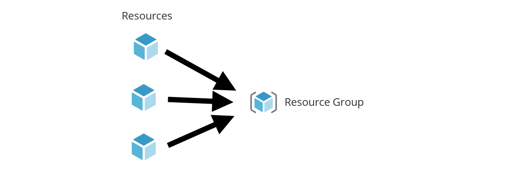

% Building your first ARM template
% Team Camp Azure
% July 31, 2019

# What is ARM?

## Azure Resource Manager

Lorem ipsum dolor sit amet, consectetur adipiscing elit. In vitae suscipit risus, id ornare neque. Pellentesque aliquam elit eget fringilla vulputate. Quisque ac nulla eros.

## Resource providers (types)

Lorem ipsum dolor sit amet, consectetur adipiscing elit. In vitae suscipit risus, id ornare neque. Pellentesque aliquam elit eget fringilla vulputate. Quisque ac nulla eros.

## Resource versions

Lorem ipsum dolor sit amet, consectetur adipiscing elit. In vitae suscipit risus, id ornare neque. Pellentesque aliquam elit eget fringilla vulputate. Quisque ac nulla eros.

## Azure Resource Manager API

Lorem ipsum dolor sit amet, consectetur adipiscing elit. In vitae suscipit risus, id ornare neque. Pellentesque aliquam elit eget fringilla vulputate. Quisque ac nulla eros.

# ARM templates

## Is it JSON or a programming language?

Lorem ipsum dolor sit amet, consectetur adipiscing elit. In vitae suscipit risus, id ornare neque. Pellentesque aliquam elit eget fringilla vulputate. Quisque ac nulla eros.

## Is it JSON or a programming language?

```
{
    "item": "value",
    "second": "third
}
```

::: notes

This is my note.

- It can contain Markdown
- like this list

:::

## Basic Template Structure

```
{
    "item": "value",
    "second": "third
}
```

## Image slide

